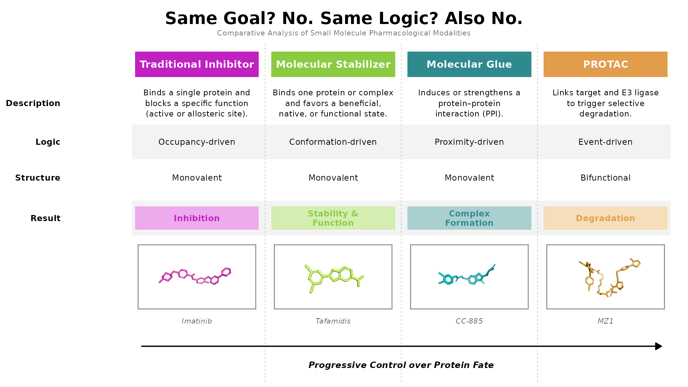

```{r, message=FALSE, error=FALSE}
pkgs <- c("ggplot2", "tidyr", "stringr", "png", "grid")
for (p in pkgs) if (!require(p, character.only = TRUE)) install.packages(p)
lapply(pkgs, library, character.only = TRUE)

# ── 1. Data ───────────────────────────────────────────────────────────────────
strategies <- c("Traditional Inhibitor", "Molecular Stabilizer",
                "Molecular Glue", "PROTAC")

hex_colors <- c("#C121C1", "#8BCB41", "#2F8A8E", "#E19D4B")
names(hex_colors) <- strategies

result_fill <- c(
  "Traditional Inhibitor" = "#EDAAED",
  "Molecular Stabilizer"  = "#D4EDB0",
  "Molecular Glue"        = "#AACFD1",
  "PROTAC"                = "#F5DEBA"
)

img_files <- c(
  "Traditional Inhibitor" = "imatinib_inhibitor.png",
  "Molecular Stabilizer"  = "tafamidis_stabilizer.png",
  "Molecular Glue"        = "cc885_glue.png",
  "PROTAC"                = "mz1_protac.png"
)

compound_names <- c(
  "Traditional Inhibitor" = "Imatinib",
  "Molecular Stabilizer"  = "Tafamidis",
  "Molecular Glue"        = "CC-885",
  "PROTAC"                = "MZ1"
)

desc_wrapped <- c(
  "Traditional Inhibitor" = "Binds a single protein and\nblocks a specific function\n(active or allosteric site).",
  "Molecular Stabilizer"  = "Binds one protein or complex\nand favors a beneficial,\nnative, or functional state.",
  "Molecular Glue"        = "Induces or strengthens a\nprotein–protein\ninteraction (PPI).",
  "PROTAC"                = "Links target and E3 ligase\nto trigger selective\ndegradation."
)

df <- data.frame(
  Strategy  = factor(strategies, levels = strategies),
  Logic     = c("Occupancy-driven", "Conformation-driven",
                "Proximity-driven", "Event-driven"),
  Structure = c("Monovalent", "Monovalent", "Monovalent", "Bifunctional"),
  Result    = c("Inhibition", "Stability &\nFunction",
                "Complex\nFormation", "Degradation"),
  stringsAsFactors = FALSE
)

# ── 2. Layout ─────────────────────────────────────────────────────────────────
# Total coordinate width = 10 units
# Row labels sit at x=0, columns at 2.2, 4.4, 6.6, 8.8 (spacing = 2.2)
X_LABEL   <-  0.0
x_centers <-  c(2.2, 4.4, 6.6, 8.8)
names(x_centers) <- strategies

COL_W  <- 2.0    # tile / pill width (just under 2.2 spacing)
IMG_HW <- 0.95   # image box half-width

X_MIN  <- -0.9
X_MAX  <- 10.05

Y_IMG_LO    <-  0.15
Y_IMG_HI    <-  2.3
Y_IMG_LABEL <- -0.25
Y_ARROW     <- -1.1
Y_ARROW_TXT <- -1.72
Y_RESULT    <-  3.2
Y_STRUCTURE <-  4.55
Y_LOGIC     <-  5.75
Y_DESC      <-  7.05
Y_HEADER    <-  8.35
Y_MIN       <- -2.3
Y_MAX       <-  9.1

# ── 3. Per-row data frames ────────────────────────────────────────────────────
d_desc <- data.frame(
  x     = x_centers[strategies],
  y     = Y_DESC,
  label = desc_wrapped[strategies],
  stringsAsFactors = FALSE
)

make_row <- function(col, y) data.frame(
  Strategy = factor(strategies, levels = strategies),
  x        = x_centers[strategies],
  y        = y,
  Value    = df[[col]],
  stringsAsFactors = FALSE
)

d_logic  <- make_row("Logic",     Y_LOGIC)
d_struct <- make_row("Structure", Y_STRUCTURE)
d_result <- make_row("Result",    Y_RESULT)

# ── 4. Molecule images ────────────────────────────────────────────────────────
imgs <- lapply(img_files[strategies], function(path) {
  if (file.exists(path)) grid::rasterGrob(png::readPNG(path), interpolate = TRUE)
  else NULL
})
names(imgs) <- strategies

# ── 5. Image box data (explicit xmin/xmax per box) ───────────────────────────
img_box_df <- data.frame(
  xmin = x_centers - IMG_HW,
  xmax = x_centers + IMG_HW,
  ymin = Y_IMG_LO,
  ymax = Y_IMG_HI
)

# Divider midpoints
dividers <- c(
  (x_centers[1] + x_centers[2]) / 2,
  (x_centers[2] + x_centers[3]) / 2,
  (x_centers[3] + x_centers[4]) / 2
)

# ── 6. Build plot ─────────────────────────────────────────────────────────────
p <- ggplot() +

  # Alternating row shading
  geom_rect(data = data.frame(yc = c(Y_LOGIC, Y_RESULT)),
            aes(xmin = x_centers[1] - 1.05,
                xmax = x_centers[4] + 1.05,
                ymin = yc - 0.58, ymax = yc + 0.58),
            fill = "grey10", alpha = 0.05, color = NA) +

  # Header tiles
  geom_tile(
    data = data.frame(x = x_centers,
                      Strategy = factor(strategies, levels = strategies)),
    aes(x = x, y = Y_HEADER, fill = Strategy),
    height = 0.85, width = COL_W) +
  geom_text(
    data = data.frame(x = x_centers, label = strategies),
    aes(x = x, y = Y_HEADER, label = label),
    color = "white", fontface = "bold", size = 7.2) +

  # Description
  geom_text(data = d_desc,
            aes(x = x, y = y, label = label),
            size = 5.8, color = "black", lineheight = 1.08) +

  # Logic
  geom_text(data = d_logic,
            aes(x = x, y = y, label = Value),
            size = 6.0, color = "black") +

  # Structure
  geom_text(data = d_struct,
            aes(x = x, y = y, label = Value),
            size = 6.0, color = "black") +

  # Result pills
  geom_tile(data = d_result,
            aes(x = x, y = y,
                fill = I(result_fill[as.character(Strategy)])),
            height = 0.78, width = COL_W) +
  geom_text(data = d_result,
            aes(x = x, y = y, label = Value,
                color = I(hex_colors[as.character(Strategy)])),
            fontface = "bold", size = 6.0, lineheight = 0.9) +

  # Column dividers
  geom_vline(xintercept = dividers,
             color = "grey72", linewidth = 0.45, linetype = "dashed") +

  # Row labels
  annotate("text", x = X_LABEL, y = Y_DESC,
           label = "Description", fontface = "bold",
           size = 6.0, hjust = 1, color = "black") +
  annotate("text", x = X_LABEL, y = Y_LOGIC,
           label = "Logic", fontface = "bold",
           size = 6.0, hjust = 1, color = "black") +
  annotate("text", x = X_LABEL, y = Y_STRUCTURE,
           label = "Structure", fontface = "bold",
           size = 6.0, hjust = 1, color = "black") +
  annotate("text", x = X_LABEL, y = Y_RESULT,
           label = "Result", fontface = "bold",
           size = 6.0, hjust = 1, color = "black") +

  # Arrow
  annotate("segment",
           x    = x_centers[1] - 0.9,
           xend = x_centers[4] + 0.9,
           y = Y_ARROW, yend = Y_ARROW,
           arrow = arrow(length = unit(0.46, "cm"), type = "closed"),
           color = "black", linewidth = 1.2) +
  annotate("text", x = mean(x_centers), y = Y_ARROW_TXT,
           label    = "Progressive Control over Protein Fate",
           fontface = "bold.italic", size = 6.2, color = "black") +

  # Image boxes — 4 separate rectangles
  geom_rect(data = img_box_df,
            aes(xmin = xmin, xmax = xmax, ymin = ymin, ymax = ymax),
            fill = NA, color = "grey55", linewidth = 0.9) +

  # Compound labels
  annotate("text", x = x_centers, y = Y_IMG_LABEL,
           label    = compound_names[strategies],
           fontface = "italic", size = 5.2, color = "grey40") +

  scale_fill_manual(values = hex_colors) +
  scale_x_continuous(limits = c(X_MIN, X_MAX), expand = c(0, 0)) +
  scale_y_continuous(limits = c(Y_MIN, Y_MAX), expand = c(0, 0)) +

  labs(
    title    = "Same Goal? No. Same Logic? Also No.",
    subtitle = "Comparative Analysis of Small Molecule Pharmacological Modalities"
  ) +
  theme_void() +
  theme(
    legend.position  = "none",
    plot.title       = element_text(hjust = 0.5, size = 34, face = "bold",
                                     margin = margin(t = 14, b = 5)),
    plot.subtitle    = element_text(hjust = 0.5, size = 15, color = "grey45",
                                     margin = margin(b = 10)),
    panel.background = element_rect(fill = "transparent", color = NA),
    plot.background  = element_rect(fill = "transparent", color = NA),
    plot.margin      = margin(10, 10, 10, 10)
  )

# ── 7. Inject molecule images ─────────────────────────────────────────────────
for (i in seq_along(strategies)) {
  grob <- imgs[[strategies[i]]]
  if (!is.null(grob)) {
    xc <- x_centers[i]
    p  <- p + annotation_custom(
      grob,
      xmin = xc - IMG_HW + 0.07, xmax = xc + IMG_HW - 0.07,
      ymin = Y_IMG_LO + 0.07,    ymax = Y_IMG_HI - 0.07
    )
  }
}

# ── 8. Export 1920×1080 ───────────────────────────────────────────────────────
ggsave("COMPARISON.png", plot = p,
       width  = 19.2,
       height = 10.8,
       dpi    = 100,
       bg     = "transparent")

message("✅ Done — 1920×1080 COMPARISON.png saved")


```