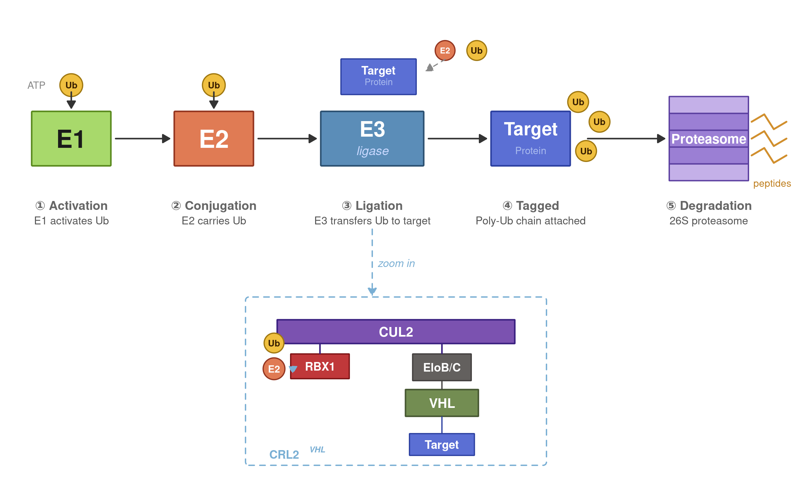

```{r, message=FALSE, error=FALSE}
library(grid)

png("ubiquitination_vhl.png",
    width = 2400, height = 1500, res = 180, bg = "transparent")
grid.newpage()

C <- list(
  # Main flow enzymes
  e1_fill  = "#A8D96B", e1_brd  = "#5A8A1E",          # E1: lime green
  e2_fill  = "#E07B54", e2_brd  = "#943520",           # E2: coral/orange-red
  e3_fill  = "#5B8DB8", e3_brd  = "#2B5070",           # E3: steel blue
  # Ubiquitin
  ub_fill  = "#F0C040", ub_brd  = "#A07810", ub_txt = "#3A2000",
  # Target protein (BRD4) – blue as in structure image
  tgt_fill = "#5B6FD4", tgt_brd = "#2B3FA0",
  # Proteasome
  pro_fill = "#9B7FD4", pro_brd = "#5B3FA0",
  pro_ring = "#C4B0E8",
  # ── Zoom box components ──────────────────────────────
  # CUL2 – large purple (matches image 1 big ellipse)
  cul_fill = "#7B52B0", cul_brd = "#3A2080",
  # RBX1 – warm red/crimson (matches image 1 red square)
  rbx_fill = "#C0383A", rbx_brd = "#7A1012",
  # EloB/C – lime green (matches image 1 green blob)
  elo_fill = "#63605E", elo_brd = "#403D3C",
  # VHL (substrate receptor) – teal/cyan (matches image 1 teal box)
  vhl_fill = "#738D52", vhl_brd = "#485933",
  # zoom box border
  zoom_brd = "#7AAFD4",
  # misc
  arrow    = "#333333",
  txt_main = "#1A1A1A",
  txt_sub  = "#555555",
  step_col = "#666666"
)

rr <- function(x, y, w, h, fill, brd, lwd=2.5, r=0.015) {
  grid.roundrect(x=unit(x,"npc"), y=unit(y,"npc"),
    width=unit(w,"npc"), height=unit(h,"npc"),
    r=unit(r,"snpc"),
    gp=gpar(fill=fill, col=brd, lwd=lwd))
}

circ <- function(x, y, r=0.022, fill, brd, lwd=2) {
  grid.circle(x=unit(x,"npc"), y=unit(y,"npc"), r=unit(r,"snpc"),
    gp=gpar(fill=fill, col=brd, lwd=lwd))
}

ub <- function(x, y, r=0.022) {
  circ(x, y, r=r, fill=C$ub_fill, brd=C$ub_brd)
  grid.text("Ub", x=unit(x,"npc"), y=unit(y,"npc"),
    gp=gpar(fontsize=11, fontface="bold", col=C$ub_txt))
}

lbl <- function(x, y, txt, size=16, face="plain", col=C$txt_main, just="centre") {
  grid.text(txt, x=unit(x,"npc"), y=unit(y,"npc"), just=just,
    gp=gpar(fontsize=size, fontface=face, col=col))
}

arr <- function(x0, y0, x1, y1, col=C$arrow, lwd=2.5, lty=1) {
  grid.lines(x=unit(c(x0,x1),"npc"), y=unit(c(y0,y1),"npc"),
    arrow=arrow(type="closed", length=unit(0.13,"inches")),
    gp=gpar(col=col, lwd=lwd, lty=lty, fill=col))
}

seg <- function(x0, y0, x1, y1, col=C$arrow, lwd=2, lty=1) {
  grid.lines(x=unit(c(x0,x1),"npc"), y=unit(c(y0,y1),"npc"),
    gp=gpar(col=col, lwd=lwd, lty=lty))
}

# ── MAIN HORIZONTAL FLOW ─────────────────────────────────
Y  <- 0.72; BW <- 0.10; BH <- 0.11
YL <- 0.585; YS <- 0.555

# STEP 1 – E1
X1 <- 0.09
rr(X1, Y, BW, BH, C$e1_fill, C$e1_brd)
lbl(X1, Y, "E1", size=30, face="bold", col="#1A1A1A")
ub(X1, Y+0.108, r=0.023)
lbl(X1-0.044, Y+0.108, "ATP", size=12, col="#888888")
arr(X1, Y+0.094, X1, Y+0.062)
lbl(X1, YL, "① Activation",    size=15, face="bold", col=C$step_col)
lbl(X1, YS, "E1 activates Ub", size=13, col=C$txt_sub)

# STEP 2 – E2
X2 <- 0.27
rr(X2, Y, BW, BH, C$e2_fill, C$e2_brd)
lbl(X2, Y, "E2", size=30, face="bold", col="white")
ub(X2, Y+0.108, r=0.023)
arr(X2, Y+0.094, X2, Y+0.062)
lbl(X2, YL, "② Conjugation",  size=15, face="bold", col=C$step_col)
lbl(X2, YS, "E2 carries Ub",  size=13, col=C$txt_sub)

arr(X1+BW/2+0.006, Y, X2-BW/2-0.006, Y)

# STEP 3 – E3 + BRD4 target above
X3 <- 0.47
rr(X3, Y, 0.13, BH, C$e3_fill, C$e3_brd)
lbl(X3, Y+0.020, "E3",     size=26, face="bold",  col="white")
lbl(X3, Y-0.024, "ligase", size=15, face="italic", col="#C8D8FF")

# BRD4 (target) above E3
rr(X3+0.008, Y+0.125, 0.095, 0.072, C$tgt_fill, C$tgt_brd, lwd=2)
lbl(X3+0.008, Y+0.138, "Target",    size=14, face="bold", col="white")
lbl(X3+0.008, Y+0.115, "Protein", size=11, col="#AABBEE")

# E2+Ub arriving at E3
circ(X3+0.092, Y+0.178, r=0.020, fill=C$e2_fill, brd=C$e2_brd)
lbl(X3+0.092, Y+0.178, "E2", size=10, face="bold", col="white")
ub(X3+0.132, Y+0.178, r=0.020)
arr(X3+0.092, Y+0.160, X3+0.068, Y+0.137, col="#888888", lwd=1.8, lty=2)

lbl(X3, YL, "③ Ligation",               size=15, face="bold", col=C$step_col)
lbl(X3, YS, "E3 transfers Ub to target", size=13, col=C$txt_sub)

arr(X2+BW/2+0.006, Y, X3-0.13/2-0.006, Y)

# STEP 4 – Ubiquitinated BRD4
X4 <- 0.67
rr(X4, Y, 0.10, BH, C$tgt_fill, C$tgt_brd)
lbl(X4, Y+0.020, "Target",    size=22, face="bold", col="white")
lbl(X4, Y-0.024, "Protein", size=12, col="#AABBEE")
ub(X4+0.060, Y+0.074, r=0.021)
ub(X4+0.087, Y+0.034, r=0.021)
ub(X4+0.070, Y-0.025, r=0.021)

lbl(X4, YL, "④ Tagged",               size=15, face="bold", col=C$step_col)
lbl(X4, YS, "Poly-Ub chain attached", size=13, col=C$txt_sub)

arr(X3+0.13/2+0.006, Y, X4-0.10/2-0.006, Y)

# STEP 5 – Proteasome
X5 <- 0.895
RX  <- 0.050
RH  <- 0.034
ring_ys <- Y + seq(-0.068, 0.068, length.out=5)
ring_fills <- c(C$pro_ring, C$pro_fill, C$pro_fill, C$pro_fill, C$pro_ring)
for (i in seq_along(ring_ys)) {
  rr(X5, ring_ys[i], RX*2, RH, ring_fills[i], C$pro_brd, lwd=2.2, r=0.010)
}
lbl(X5, Y, "Proteasome", size=16, face="bold", col="white")

for (dy in c(0.034, 0.000, -0.034)) {
  xs <- X5 + c(0.054, 0.070, 0.082, 0.098)
  ys <- Y  + dy + c(0, 0.015, -0.015, 0)
  grid.lines(x=unit(xs,"npc"), y=unit(ys,"npc"),
    gp=gpar(col="#D18F2D", lwd=3.0))
}
lbl(X5+0.080, Y-0.090, "peptides", size=12, col="#C08020")

lbl(X5, YL, "⑤ Degradation", size=15, face="bold", col=C$step_col)
lbl(X5, YS, "26S proteasome", size=13, col=C$txt_sub)

arr(X4+0.10/2+0.022, Y, X5-RX-0.006, Y)

# ── ZOOM BOX ─────────────────────────────────────────────
ZX <- 0.50; ZY <- 0.23; ZW <- 0.38; ZH <- 0.34
ZOOM_TOP <- ZY + ZH/2

ARROW_START_Y <- YS - 0.018
ARROW_MID_Y   <- (ARROW_START_Y + ZOOM_TOP) / 2

arr(X3, ARROW_START_Y,
    X3, ZOOM_TOP + 0.004,
    col="#7AAFD4", lwd=2.2, lty=2)

lbl(X3+0.03, ARROW_MID_Y,
    "zoom in", size=13, face="italic", col="#7AAFD4")

# dashed border, no fill
grid.roundrect(
  x=unit(ZX,"npc"), y=unit(ZY,"npc"),
  width=unit(ZW,"npc"), height=unit(ZH,"npc"),
  r=unit(0.02,"snpc"),
  gp=gpar(fill=NA, col=C$zoom_brd, lwd=2.2, lty="dashed"))

# CRL2^VHL label – bottom-left inside zoom box
lbl(ZX - ZW/2 + 0.030, ZY - ZH/2 + 0.022,
    "CRL2", size=14, face="bold", col="#7AAFD4", just="left")
lbl(ZX - ZW/2 + 0.080, ZY - ZH/2 + 0.032,
    "VHL", size=10, face="bold.italic", col="#7AAFD4", just="left")

# ── CUL2 – wide bar ──────────────────────────────────────
CUL_Y <- ZY + 0.100
CUL_W <- 0.30
CUL_H <- 0.048
rr(ZX, CUL_Y, CUL_W, CUL_H, fill=C$cul_fill, brd=C$cul_brd, lwd=2.5, r=0.010)
lbl(ZX, CUL_Y, "CUL2", size=16, face="bold", col="white")

# ── RBX1 – left end of CUL4A ──────────────────────────
RBX_X <- ZX - 0.096
RBX_Y <- ZY + 0.030
rr(RBX_X, RBX_Y, 0.074, 0.050, C$rbx_fill, C$rbx_brd, lwd=2, r=0.01)
lbl(RBX_X, RBX_Y, "RBX1", size=14, face="bold", col="white")
seg(RBX_X, CUL_Y - CUL_H/2,
    RBX_X, RBX_Y + 0.026,
    col=C$cul_brd, lwd=2.5)

# CHANGED: E2 + Ub added to the left of RBX1 inside zoom box
E2Z_X <- RBX_X - 0.058
E2Z_Y <- RBX_Y - 0.005
circ(E2Z_X, E2Z_Y, r=0.022, fill=C$e2_fill, brd=C$e2_brd)
lbl(E2Z_X, E2Z_Y, "E2", size=12, face="bold", col="white")
ub(E2Z_X, E2Z_Y + 0.052, r=0.020)
# dashed arrow from E2 toward RBX1
arr(E2Z_X + 0.024, E2Z_Y,
    RBX_X - 0.039, RBX_Y,
    col="#7AAFD4", lwd=1.8, lty=2)

# ── EloB/C – right side of CUL2 ────────────────────────
ELO_X <- ZX + 0.058
ELO_Y <- ZY + 0.028
rr(ELO_X, ELO_Y, 0.074, 0.054, C$elo_fill, C$elo_brd, lwd=2, r=0.01)
lbl(ELO_X, ELO_Y, "EloB/C", size=14, face="bold", col="white")
seg(ELO_X, CUL_Y - CUL_H/2,
    ELO_X, ELO_Y + 0.028,
    col=C$cul_brd, lwd=2.5)

# ── VHL – below EloB/C ─────────────────────────────────
VHL_X <- ELO_X
VHL_Y <- ZY - 0.044
rr(VHL_X, VHL_Y, 0.092, 0.054, C$vhl_fill, C$vhl_brd, lwd=2.5, r=0.01)
lbl(VHL_X, VHL_Y, "VHL", size=16, face="bold",   col="white")
seg(VHL_X, ELO_Y - 0.028,
    VHL_X, VHL_Y + 0.028,
    col=C$elo_brd, lwd=2)

# ── Target bound to VHL ──────────────────────────────
BRD_X <- ELO_X
BRD_Y <- ZY - 0.128
rr(BRD_X, BRD_Y, 0.082, 0.044, C$tgt_fill, C$tgt_brd, lwd=2, r=0.015)
lbl(BRD_X, BRD_Y, "Target",    size=14, face="bold", col="white")
seg(BRD_X, VHL_Y - 0.028,
    BRD_X, BRD_Y + 0.023,
    col=C$tgt_brd, lwd=2)

dev.off()
cat("Done.\n")


```

